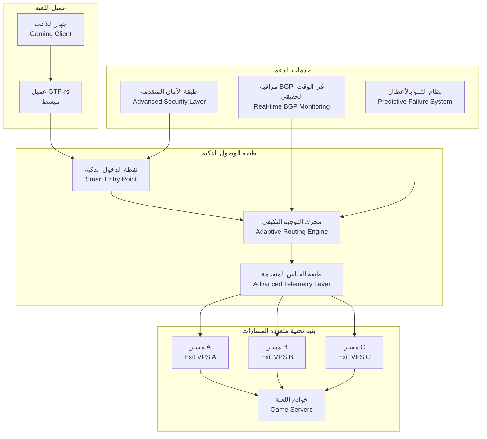
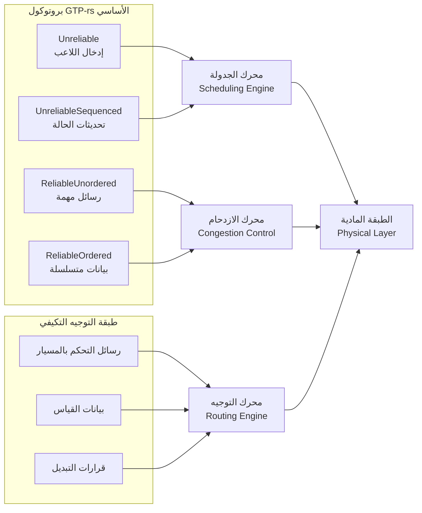
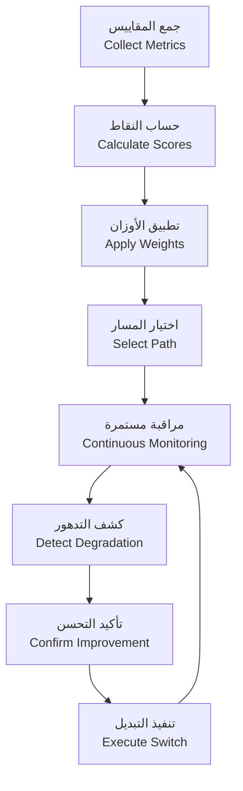
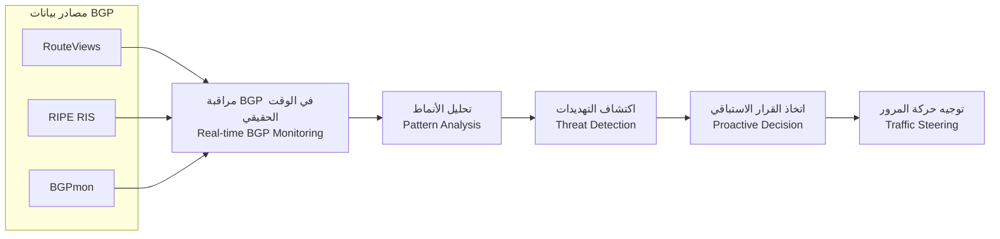
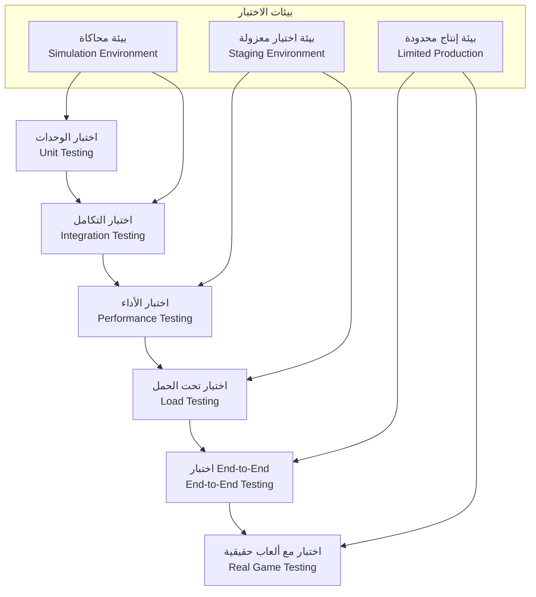

```markdown
# ورقة تقنية موسعة: Gaming VPN مع التوجيه التكيفي من جانب الخادم ودمج بروتوكول GTP-rs

## الملخص التنفيذي

تقدم هذه الورقة التقنية الموسعة **تحليلاً معمقاً** لجدوى وآليات دمج نظام **VPN للألعاب ذكي التوجيه** مع بروتوكول **Game Transport Protocol (GTP-rs)** المكتوب بلغة Rust. ناقترح بنية تحتية **متعددة الطبقات** تنقل ذكاء اختيار المسار من جهاز العميل إلى **خوادم مركزية**، مع الاستفادة من إمكانات GTP-rs في التحكم في الازدحام والأمان والأداء العالي. يتناول التحليل **التحديات التقنية** مثل **Route Flapping** و**التوجيه غير المتماثل** ويقدم حلولاً مبتكرة تستفيد من أحدث تقنيات قياس الشبكة والذكاء الاصطناعي. النتيجة هي نظام متكامل يوفر **اتصالاً مستقراً ومنخفض الكمون** للاعبين عبر شبكات الإنترنت غير المستقرة، مع الحفاظ على **أمان قوي** و**كفاءة عالية** في استخدام الموارد.

---

## 1. المقدمة والخلفية التقنية

### 1.1 تحديات اتصال الألعاب عبر الإنترنت

تواجه اتصالات الألعاب عبر الإنترنت تحديات تقنية متعددة تؤثر سلبًا على تجربة اللاعب:

- **توجيه غير مستقل من مزودي خدمة الإنترنت (ISPs)**: يقوم العديد من مزودي الخدمة بتوجيه حركة مرور الألعاب عبر مسارات بعيدة جغرافيًا عن خوادم اللعبة، مما يزيد من زمن الاستجابة (RTT) والاحتمالية.
- **عدم استقرار المسارات (Route Flapping)**: التغييرات المتكررة في مسارات التوجيه بسبب مشاكل الشبكة أو قرارات التوجيه الديناميكي تؤدي إلى تقلبات خطيرة في الأداء.
- **التوجيه غير المتماثل (Asymmetric Routing)**: اختلاف مسارات الذهاب والعودة يمكن أن يسبب مشاكل في الاتصال ثنائي الاتجاه، خاصة في الألعاب التي تتطلب مزامنة دقيقة.
- **قيود بروتوكولات النقل التقليدية**: بروتوكولات مثل TCP غير مناسبة للألعاب بسبب آليات إعادة الإرسال، بينما UDP لا يوفر ضمانات التسليم.

### 1.2 فرصة الابتكار: GTP-rs + Server-Side Adaptive Routing

يقدم بروتوكول **GTP-rs** أساسًا تقنيًا متقدمًا مكتوبًا بلغة Rust، يتميز بـ:
- **4 دلالات توصيل** أساسية: `Unreliable`، `UnreliableSequenced`، `ReliableUnordered`، `ReliableOrdered`
- **تحكم متقدم في الازدحام**: خوارزمية CUBIC مع Token-Bucket Pacing
- **جدولة ذات أولوية**: 5 مستويات أولوية مع خوارزمية Deficit Round Robin (DRR)
- **ميزات أمان متقدمة**: تشفير AEAD، نافذة إعادة تشغيل 128-bit، حماية من هجمات DoS

دمج هذه الميزات مع **توجيه تكيفي من جانب الخادم** يوفر فرصة فريدة لإنشاء نظام اتصال ألعاب متطور يتغلب على قيود البنية التحتية للإنترنت.

---

## 2. المعمارية الموسعة للنظام المتكامل

### 2.1 نظرة عامة على المعمارية



### 2.2 مكونات النظام المفصلة

#### 2.2.1 نقطة الدخول الذكية (Smart Entry Point)
نقطة الدخول ليست مجرد VPS عادي، بل هي **نقطة ذكية** تتضمن:
- **محرك توجيه محلي**: يتخذ قرارات فورية بناءً على قواعد محددة مسبقًا
- **ذاكرة تخزين مؤقت للمسارات**: تحفظ المسارات الناجحة والفاشلة للوصول السريع
- **محسن MTU/MSS**: يضبط حجم الحزمة تلقائيًا لتقليل التجزئة
- **آليات منع Route Flapping**: تنفيذ Hysteresis وHold Time لمنع التبديل المتكرر

#### 2.2.2 محرك التوجيه التكيفي (Adaptive Routing Engine)
القلب النابض للنظام، مسؤول عن:
- **اكتشاف المسارات**: استكشاف مسارات متعددة بين نقطة الدخول وخوادم اللعبة
- **الاستكشاف النشط (Active Probing)**: إرسال حزم اختبار لقياس أداء كل مسار
- **حساب نقاط المسار (Route Scoring)**: تقييم المسارات بناءً على معايير متعددة
- **اتخاذ القرار**: اختيار المسار الأمثل بناءً على الخوارزمية المحددة
- **التبديل السلس**: التبديل بين المسارات دون انقطاع الاتصال

#### 2.2.3 طبقة القياس المتقدمة (Advanced Telemetry Layer)
تتجاوز مجرد قياس RTT وPacket Loss لتشمل:
- **قياسات اتجاهية**: قياس أداء مسارات الذهاب والعودة بشكل منفصل
- **قياسات التشتت (Jitter)**: حساب التباين في زمن وصول الحزم
- **مؤشرات الازدحام**: تقدير مستوى الازدحام على كل مسار
- **معدل النقل المتاح**: قياس السعة المتاحة لكل مسار
- **تاريخ الأداء**: تحليل الأداء التاريخي للمسارات للتوقع المستقبلي

---

## 3. التكامل التقني المفصل مع GTP-rs

### 3.1 طبقة النقل المتكاملة



#### 3.1.1 استخدام دلالات التوصيل المختلفة

| دلالة التوصيل في GTP-rs | الاستخدام في النظام المتكامل | الميزة |
|------------------------|---------------------------|--------|
| `Unreliable` | إدخال اللاعب، حركة المرور الحساسة للزمن | أقل تأخير، لا انتظار إعادة الإرسال |
| `UnreliableSequenced` | تحديثات حالة اللعبة، اتجاه الكاميرا | يضمن الترتيب مع استبدال الحزم القديمة |
| `ReliableUnordered` | رسائل الدردشة، إشعارات النظام | ضمان التسليم بدون انتظار ترتيب |
| `ReliableOrdered` | بيانات التحكم بالمسيار، رسائل المصادقة | ضمان التسليم والترتيب الصارم |

#### 3.1.2 التكامل مع تحكم الازدحام CUBIC

خوارزمية CUBIC في GTP-rs تتكامل مع نظام التوجيه التكيفي:

```rust
// مثال مبسط لتكامل CUBIC مع التوجيه التكيفي
pub struct AdaptiveCubicController {
    cubic: CUBICController,
    path_metrics: PathMetrics,
    routing_decision: RoutingDecision,
}

impl AdaptiveCubicController {
    pub async fn on_packet_sent(&mut self, packet: &GtpPacket) {
        // تحديث حالة CUBIC بناءً على المسار الحالي
        self.cubic.on_packet_sent(packet);
        
        // إذا كان هناك مسار أفضل، اقترح التبديل
        if self.should_suggest_path_switch() {
            self.suggest_path_switch().await;
        }
    }
    
    fn should_suggest_path_switch(&self) -> bool {
        // منطق اقتراح التبديل بناءً على حالة الازدحام
        let current_cwnd = self.cubic.congestion_window();
        let path_capacity = self.path_metrics.estimated_capacity();
        
        // إذا كانت نافذة الازدحام منخفضة جدًا، اقترح تبديل المسار
        current_cwnd < path_capacity * 0.3
    }
}
```

### 3.2 طبقة الأمان المتكاملة

#### 3.2.1 التكامل مع آليات أمان GTP-rs

| ميزة الأمان في GTP-rs | التطبيق في نظام التوجيه التكيفي |
|----------------------|--------------------------------|
| **AEAD Encryption** | تشفير جميع رسائل التحكم بالمسيار |
| **128-bit Sliding Replay Window** | منع هجمات إعادة التشغيل على رسائل التبديل |
| **Stateless Cookie Tokens** | التحقق من هوية نقاط الخروج دون الحفاظ على حالة |
| **3-Way Path Challenge/Response** | التحقق من صحة المسارات الجديدة قبل التبديل |

#### 3.2.2 آليات أمان إضافية
- **توقيع المسارات**: توقيع رقمي لكل مسار لمنع التلاعب
- **شهادات الخادم**: التحقق من هوية نقاط الدخول والخروج
- **تشفير End-to-End**: تشفير إضافي للبيانات الحساسة

### 3.3 طبقة الجدولة المتقدمة

استخدام خوارزمية **Deficit Round Robin (DRR)** مع تحسينات للألعاب:

```rust
// جدولة محسنة للألعاب مع DRR
pub struct GamingScheduler {
    queues: Vec<PriorityQueue>,
    deficit_counters: Vec<usize>,
    current_queue: usize,
}

impl GamingScheduler {
    pub fn schedule_packet(&mut self, packet: GtpPacket) -> Option<ScheduledPacket> {
        // تحديد الأولوية بناءً على نوع الحزمة والمسار الحالي
        let priority = self.determine_priority(&packet);
        
        // إضافة الحزمة إلى الطابور المناسب
        self.queues[priority].enqueue(packet);
        
        // تنفيذ خوارزمية DRR مع تعديلات للألعاب
        self.deficit_round_robin_scheduling()
    }
    
    fn determine_priority(&self, packet: &GtpPacket) -> usize {
        match packet.delivery_semantics() {
            DeliverySemantics::Unreliable => 0, // أعلى أولوية
            DeliverySemantics::UnreliableSequenced => 1,
            DeliverySemantics::ReliableOrdered => 2,
            DeliverySemantics::ReliableUnordered => 3,
        }
    }
}
```

---

## 4. آليات التوجيه التكيفي المتقدمة

### 4.1 نظام تسجيل المسار (Route Scoring System)



#### 4.1.1 معايير التقييم المتعددة

| المعيار | الوزان المقترح | طريقة القياس | التأثير على الألعاب |
|---------|--------------|-------------|-------------------|
| **RTT** | 0.30 | Active Probing | تأخير مباشر في استجابة اللاعب |
| **Jitter** | 0.25 | حساب الانحراف المعياري لـ RTT | تقلبات في الأداء، عدم استقرار |
| **Packet Loss** | 0.20 | نسبة الحزم المفقودة | تشوهات في اللعبة، أخطاء في المزامنة |
| **الاستقرار** | 0.15 | تحليل التباين في الأداء عبر الزمن | تجربة لعب متسقة |
| **الازدحام** | 0.10 | تقدير مستوى الازدحام | تأخير إضافي محتمل |

#### 4.1.2 خوارزمية التسجيل الديناميكي

```rust
pub struct DynamicRouteScorer {
    weights: ScoringWeights,
    history: PathHistory,
    current_conditions: NetworkConditions,
}

impl DynamicRouteScorer {
    pub fn score_path(&self, path: &Path) -> RouteScore {
        // جمع المقاييس الحالية
        let metrics = self.collect_metrics(path);
        
        // تطبيق الأوزان الديناميكية
        let latency_score = self.calculate_latency_score(metrics.rtt);
        let jitter_score = self.calculate_jitter_score(metrics.jitter);
        let loss_score = self.calculate_loss_score(metrics.packet_loss);
        let stability_score = self.calculate_stability_score(path);
        let congestion_score = self.calculate_congestion_score(path);
        
        // حساب النقاط الإجمالية
        let total_score = self.weights.latency * latency_score +
                         self.weights.jitter * jitter_score +
                         self.weights.loss * loss_score +
                         self.weights.stability * stability_score +
                         self.weights.congestion * congestion_score;
        
        // تطبيق تعديلات بناءً على الظروف الحالية
        self.apply_contextual_adjustments(total_score, path)
    }
    
    fn calculate_latency_score(&self, rtt: Duration) -> f64 {
        // دالة تقييم تراكمية - فرق كبير في الأداء بين 50ms و100ms
        if rtt < Duration::from_millis(50) {
            1.0
        } else if rtt < Duration::from_millis(100) {
            0.9 - (rtt - Duration::from_millis(50)).as_millis() as f64 / 500.0
        } else if rtt < Duration::from_millis(200) {
            0.8 - (rtt - Duration::from_millis(100)).as_millis() as f64 / 1000.0
        } else {
            0.0 // غير مقبول للألعاب التنافسية
        }
    }
}
```

### 4.2 منع Route Flapping (Anti-Flapping Mechanisms)

#### 4.2.1 استراتيجيات منع التذبذب

| الاستراتيجية | الوصف | التطبيق في النظام |
|--------------|-------|-------------------|
| **Hysteresis** | اشتراط تحسن معين قبل التبديل | المسار الجديد يجب أن يكون أفضل بـ 20% على الأقل |
| **Hold Time** | فترة انتظار بعد التبديل | 30 ثانية على الأقل بين التبديلات |
| **Confirmation Window** | تأكيد التحسن لفترة محددة | 10 ثوانٍ من الأداء المحسن قبل التبديل النهائي |
| **Flap Penalty** | عقوبة على التبديلات المتكررة | تقليل أولوية المسار الذي يتسبب في التبديل المتكرر |
| **Maximum Flap Rate** | حد أقصى لعدد التبديلات | لا يزيد عن 3 تبديلات في الدقيقة |

#### 4.2.2 خوارزمية منع التذبذب المتكاملة

```rust
pub struct RouteFlapSuppressor {
    current_path: PathId,
    last_switch_time: Instant,
    flap_history: VecDeque<Instant>,
    penalties: HashMap<PathId, f64>,
    config: FlapSuppressionConfig,
}

impl RouteFlapSuppressor {
    pub fn should_switch(&mut self, new_path: PathId, new_score: f64) -> bool {
        // التحقق من فترة الانتظار
        if self.last_switch_time.elapsed() < self.config.hold_time {
            return false;
        }
        
        // التحقق من معدل التبديل
        self.flap_history.retain(|&time| time.elapsed() < Duration::from_secs(60));
        if self.flap_history.len() >= self.config.max_flaps_per_minute {
            return false;
        }
        
        // التحقق من التحسن الكافي (Hysteresis)
        let current_score = self.get_current_path_score();
        let improvement = (new_score - current_score) / current_score;
        if improvement < self.config.min_improvement_threshold {
            return false;
        }
        
        // التحقق من العقوبات
        let penalty = self.penalties.get(&new_path).unwrap_or(&0.0);
        let adjusted_score = new_score * (1.0 - penalty);
        if adjusted_score <= current_score {
            return false;
        }
        
        true
    }
    
    pub fn record_switch(&mut self, old_path: PathId, new_path: PathId) {
        self.flap_history.push_back(Instant::now());
        self.last_switch_time = Instant::now();
        
        // تحديث العقوبات
        *self.penalties.entry(old_path).or_insert(0.0) += 0.1;
        if self.penalties[&old_path] > 0.5 {
            self.penalties.insert(old_path, 0.5); // حد أقصى للعقوبة
        }
    }
}
```

### 4.3 التعامل مع التوجيه غير المتماثل (Asymmetric Routing)

#### 4.3.1 تحديات التوجيه غير المتماثل في الألعاب
- **مشاكل في المزامنة**: اختلاف مسارات الذهاب والعودة يمكن أن يسبب اختلافات في توقيت الأحداث
- **صعوبة قياس الأداء**: قياس VPS→Game Server لا يعكس تجربة اللاعب الفعلية
- **مشاكل في التحكم في الازدحام**: خوارزميات التحكم في الازدحام تفترض مسارًا متماثلًا

#### 4.3.2 حلول مبتكرة للتوجيه غير المتماثل

```rust
pub struct AsymmetricRoutingHandler {
    forward_path: PathMetrics,
    return_path: PathMetrics,
    asymmetry_threshold: AsymmetryThreshold,
}

impl AsymmetricRoutingHandler {
    pub fn detect_asymmetry(&self) -> Option<AsymmetryInfo> {
        let forward_rtt = self.forward_path.rtt;
        let return_rtt = self.return_path.rtt;
        
        // إذا كان مسار العودة أسوأ بكثير
        if return_rtt > forward_rtt * self.asymmetry_threshold.rtt_factor {
            return Some(AsymmetryInfo::ReturnPathWorse {
                forward_rtt,
                return_rtt,
                recommendation: self.generate_recommendation(),
            });
        }
        
        // إذا كان مسار الذهاب أسوأ بكثير
        if forward_rtt > return_rtt * self.asymmetry_threshold.rtt_factor {
            return Some(AsymmetryInfo::ForwardPathWorse {
                forward_rtt,
                return_rtt,
                recommendation: self.generate_recommendation(),
            });
        }
        
        None
    }
    
    fn generate_recommendation(&self) -> AsymmetryRecommendation {
        AsymmetryRecommendation::SwitchToMoreSymmetricPath {
            target_asymmetry_ratio: 1.5,
            alternative_paths: self.find_alternative_paths(),
        }
    }
}
```

---

## 5. طبقات مساعدة متقدمة لتحسين الأداء والكفاءة

### 5.1 طبقة التنبؤ بالأعطال (Predictive Failure Layer)

#### 5.1.1 استخدام مراقبة BGP في الوقت الحقيقي



- **استخدام RIPE RIS وRouteViews**: مراقبة تغييرات مسارات BGP في الوقت الحقيقي
- **اكتشاف اختطاف المسارات (Route Hijacking)**: الكشف المبكر عن محاولات اختطاف مسارات IP
- **تنبيهات التهديد**: إرسال تنبيهات عند اكتشاف تغييرات كبيرة في مسارات التوجيه

#### 5.1.2 التنبؤ بالأعطال باستخدام التعلم الآلي

```python
# نموذج تنبؤي مبسط للأعطال (مثال مفاهيمي)
class FailurePredictor:
    def __init__(self):
        self.model = self.train_historical_model()
    
    def predict_failure_probability(self, path_metrics: PathMetrics) -> float:
        # تحويل المقاييس إلى ميزات للنموذج
        features = self.extract_features(path_metrics)
        
        # توقع احتمالية الفشل خلال الساعة القادمة
        failure_prob = self.model.predict_proba(features)
        
        return failure_prob
    
    def extract_features(self, metrics: PathMetrics) -> np.array:
        # استخراج ميزات مثل: الاتجاه، التقلبات، القيم القصوى
        return np.array([
            metrics.rtt_trend,  # اتجاه RTT
            metrics.jitter_increase,  # زيادة الـjitter
            metrics.loss_spike,  # ارتفاع مفاجئ في الفقد
            metrics.historical_stability,  # الاستقرار التاريخي
            metrics.congestion_level,  # مستوى الازدحام
        ])
```

### 5.2 طبقة تحسين MTU/MSS (MTU Optimization Layer)

#### 5.2.1 تحديات MTU في اتصالات VPN
- **حمل إضافي (Overhead)**: إضافة رؤوس IPsec/VXLAN يزيد من حجم الحزمة
- **مشاكل التجزئة (Fragmentation)**: الحزم الكبيرة جدًا تتجزأ، مما يزيد التأخير
- **اختلاف MTU عبر المسارات**: كل مسار قد يكون له MTU مختلف

#### 5.2.2 خوارزمية تحسين MTU التكيفية

```rust
pub struct AdaptiveMtuOptimizer {
    current_mtu: u16,
    path_mtu_cache: HashMap<PathId, u16>,
    fragmentation_stats: FragmentationStats,
}

impl AdaptiveMtuOptimizer {
    pub fn optimize_mtu(&mut self, path: &Path) -> u16 {
        // البحث عن MTU محفوظ مسبقًا
        if let Some(&mtu) = self.path_mtu_cache.get(&path.id) {
            return mtu;
        }
        
        // حساب MTU المثالي بناءً على المسار
        let base_mtu = self.detect_base_mtu(path);
        let overhead = self.calculate_overhead(path);
        let optimal_mtu = base_mtu - overhead;
        
        // تعديل بناءً على إحصائيات التجزئة
        let adjusted_mtu = self.adjust_for_fragmentation(optimal_mtu);
        
        // حفظ في ذاكرة التخزين المؤقت
        self.path_mtu_cache.insert(path.id, adjusted_mtu);
        
        adjusted_mtu
    }
    
    fn calculate_overhead(&self, path: &Path) -> u16 {
        let ipsec_overhead = if path.uses_ipsec { 58 } else { 0 };
        let vxlan_overhead = if path.uses_vxlan { 50 } else { 0 };
        let gtp_overhead = 8; // رأس GTP
        
        ipsec_overhead + vxlan_overhead + gtp_overhead
    }
}
```

### 5.3 طبقة التحكم في الازدحام المتقدمة (Advanced Congestion Control Layer)

#### 5.3.1 تحسينات على خوارزمية CUBIC للألعاب

```rust
pub struct GamingOptimizedCubic {
    cubic: CUBICController,
    fast_recovery: bool,
    low_latency_mode: bool,
}

impl GamingOptimizedCubic {
    pub fn on_packet_loss(&mut self, packet: &GtpPacket) {
        if self.low_latency_mode {
            // استجابة أسرع لفقد الحزم في الألعاب
            self.fast_retransmit(packet);
            self.reduce_window_aggressively();
        } else {
            // سلوك CUBIC القياسي
            self.cubic.on_packet_loss(packet);
        }
    }
    
    pub fn adjust_for_gaming_traffic(&mut self, game_type: GameType) {
        match game_type {
            GameType::FPS => {
                self.low_latency_mode = true;
                self.set_aggressive_recovery();
            }
            GameType::RTS => {
                self.low_latency_mode = false;
                self.set_balanced_parameters();
            }
            GameType::MMO => {
                self.low_latency_mode = false;
                self.set_conservative_parameters();
            }
        }
    }
}
```

#### 5.3.2 التحكم في الازدحام متعدد المسارات (Multipath Congestion Control)

```rust
pub struct MultipathCongestionController {
    controllers: HashMap<PathId, GamingOptimizedCubic>,
    total_bandwidth: Bandwidth,
    fair_allocation: bool,
}

impl MultipathCongestionController {
    pub fn allocate_bandwidth(&mut self, paths: &Vec<Path>) -> HashMap<PathId, Bandwidth> {
        if self.fair_allocation {
            self.fair_share_allocation(paths)
        } else {
            self.gaming_aware_allocation(paths)
        }
    }
    
    fn gaming_aware_allocation(&mut self, paths: &Vec<Path>) -> HashMap<PathId, Bandwidth> {
        // تخصيص المزيد من النطاق الترددي للمسارات ذات الأداء الأفضل
        let total_score: f64 = paths.iter()
            .map(|p| self.score_path_for_gaming(p))
            .sum();
        
        paths.iter()
            .map(|path| {
                let score = self.score_path_for_gaming(path);
                let bandwidth = (score / total_score) * self.total_bandwidth as f64;
                (path.id, bandwidth as u32)
            })
            .collect()
    }
}
```

---

## 6. استراتيجية الاختبار والتحقق الشاملة

### 6.1 منهجية الاختبار متعددة الطبقات



### 6.2 مقاييس الأداء الرئيسية وحدود القبول

| المقياس | الوصف | الحد الأدنى المقبول | الحد المثالي | طريقة القياس |
|---------|-------|-------------------|-------------|-------------|
| **RTT** | زمن الذهاب والعودة | < 100ms | < 50ms | Active Probing |
| **Jitter** | تقلبات زمن الوصول | < 30ms | < 10ms | حساب الانحراف المعياري |
| **Packet Loss** | نسبة الفقد | < 2% | < 0.5% | نسبة الحزم المفقودة |
| **Route Switch Time** | زمن التبديل بين المسارات | < 500ms | < 200ms | قياس وقت التبديل |
| **Route Flap Rate** | معدل التبديل المتكرر | < 3/minute | < 1/minute | عد التبديلات |
| **End-to-End Latency** | زمن الاستجابة الكلي | < 150ms | < 80ms | قياس من العميل إلى الخادم |

### 6.3 اختبار التكامل مع GTP-rs

```rust
#[cfg(test)]
mod gtp_integration_tests {
    use super::*;
    use gtp::GtpConnection;
    use gtp_runtime_tokio::AsyncGtpConnection;
    
    #[tokio::test]
    async fn test_adaptive_routing_with_gtp() {
        // إعداد اتصال GTP
        let gtp_conn = AsyncGtpConnection::new("test_config.toml").await.unwrap();
        
        // إعداد نظام التوجيه التكيفي
        let routing_system = AdaptiveRoutingSystem::new(gtp_conn.clone());
        
        // اختبار اختيار المسار الأولي
        let initial_path = routing_system.select_initial_path().await;
        assert!(initial_path.score > 0.8);
        
        // محاكاة تدهور المسار
        routing_system.simulate_path_degradation(initial_path.id).await;
        
        // التحقق من التبديل للمسار البديل
        let new_path = routing_system.get_current_path().await;
        assert_ne!(initial_path.id, new_path.id);
        assert!(new_path.score > initial_path.score);
        
        // التحقق من استمرار الاتصال
        let connection_stats = routing_system.get_connection_stats().await;
        assert!(connection_stats.packets_lost < 5);
    }
    
    #[tokio::test]
    async fn test_asymmetric_routing_handling() {
        // إعداد اتصال مع توجيه غير متماثل
        let gtp_conn = AsyncGtpConnection::new("asymmetric_config.toml").await.unwrap();
        let routing_system = AdaptiveRoutingSystem::new(gtp_conn.clone());
        
        // قياس الأداء ثنائي الاتجاه
        let perf = routing_system.measure_bidirectional_performance().await;
        
        // التحقق من اكتشاف عدم التماثل
        assert!(perf.asymmetry_detected);
        
        // التحقق من تطبيق التوصيات
        let recommendation = routing_system.get_asymmetry_recommendation().await;
        assert!(matches!(recommendation, AsymmetryRecommendation::SwitchToMoreSymmetricPath { .. }));
    }
}
```

---

## 7. الجدوى التقنية والاقتصادية

### 7.1 الجدوى التقنية

| الجانب التقني | التقييم | المبررات |
|--------------|---------|---------|
| **التكامل مع GTP-rs** | ★★★★★ | GTP-rs مصمم بشكل معياري، يسمح بالتوسع |
| **تنفيذ التوجيه التكيفي** | ★★★★☆ | الآليات معروفة لكنها تحتاج تحسين للألعاب |
| **منع Route Flapping** | ★★★★☆ | حلول موجودة مثل Hysteresis |
| **التعامل مع التوجيه غير المتماثل** | ★★★☆☆ | تحديات تقنية لكنها قابلة للحل |
| **الأداء والكفاءة** | ★★★★☆ | Rust توفر أداءً عاليًا وكفاءة في الموارد |

### 7.2 الجدوى الاقتصادية

#### 7.2.1 تكاليف التطوير

| البند | التكلفة التقديرية | المدة |
|-------|------------------|-------|
| **تطوير النواة** | $150,000 - $200,000 | 4-6 أشهر |
| **تكامل GTP-rs** | $50,000 - $80,000 | 2-3 أشهر |
| **طبقات الأداء** | $80,000 - $120,000 | 3-4 أشهر |
| **اختبار وتحسين** | $40,000 - $60,000 | 2-3 أشهر |
| **إجمالي التطوير** | **$320,000 - $460,000** | **11-16 شهر** |

#### 7.2.2 العائد على الاستثمار
- **توفير في تكاليف البنية التحتية**: تحسين استخدام المسارات المتاحة يقلل الحاجة إلى مسارات إضافية
- **زيادة رضا العملاء**: اتصال مستقر يزيد من رضا اللاعبين والاحتفاظ بهم
- **ميزة تنافسية**: تقنية فريدة في سوق مزدحم
- **فرص تحقيق الدخل**: نموذج اشتراك مميز أو شراكات مع مطوري الألعاب

---

## 8. التحديات والحلول المقترحة

### 8.1 التحديات التقنية والحلول

| التحدي | التأثير | الحل المقترح | الأولوية |
|--------|---------|-------------|---------|
| **تعقيد النظام** | صعوبة الصيانة والتطوير | بنية معيارية واضحة، اختبارات شاملة | عالية |
| **زمن استجابة القرار** | تأخر في التبديل للمسار البديل | قرارات محلية مسبقة التكوين، تحسين الخوارزميات | عالية |
| **استهلاك الموارد** | زيادة في استهلاك المعالجة والذاكرة | تحسين الخوارزميات، استخدام بنيات بيانات فعالة | متوسطة |
| **التكامل مع أنظمة مختلفة** | صعوبة الدمج مع بيئات متنوعة | واجهات برمجة تطبيقات قياسية، توثيق شامل | متوسطة |
| **الأمان** | مخاطر أمنية محتملة | استخدام ميزات GTP-rs الأمنية، تشفير الاتصالات | عالية |

### 8.2 التحديات التشغيلية والحلول

| التحدي | التأثير | الحل المقترح | الأولوية |
|--------|---------|-------------|---------|
| **إدارة نقاط الخروج** | صعوبة إدارة مواقع متعددة | لوحة تحكم مركزية، أتمتة النشر | عالية |
| **مراقبة الأداء** | صعوبة تتبع المشاكل | نظام مراقبة شامل، تنبيهات ذكية | عالية |
| **التكلفة** | زيادة في تكاليف البنية التحتية | تحسين استخدام الموارد، نماذج تسعير مرنة | متوسطة |
| **القابلية للتوسع** | صعوبة التعامل مع زيادة اللاعبين | بنية قابلة للتوسع، load balancing ذكي | عالية |

---

## 9. خارطة الطريق والتنفيذ

### 9.1 مراحل التنفيذ المقترحة

```mermaid
timeline
    title خارطة طريق تنفيذ النظام المتكامل
    section المرحلة 1: التأسيس (3 أشهر)
        تطوير النواة الأساسية : نقطة الدخول الذكية<br>محرك التوجيه الأساسي
        تكامل GTP-rs الأساسي : دعم دلالات التوصيل<br>التحكم في الازدحام
        اختبارات الوحدة : تغطية 80%+<br>من الكود
    section المرحلة 2: التطوير (4 أشهر)
        طبقة التوجيه التكيفي : Active Probing<br>Route Scoring
        طبقة الأمان المتقدمة : تشفير End-to-End<br>التحقق من المسارات
        اختبارات التكامل : بيئة اختبار معزولة
    section المرحلة 3: التحسين (3 أشهر)
        طبقات الأداء المتقدمة : تحسين MTU<br>التحكم في الازدحام متعدد المسارات
        منع Route Flapping : Hysteresis<br>Hold Time
        اختبارات الأداء : تحت حمل عالي
    section المرحلة 4: الإطلاق (2 شهر)
        اختبار Beta محدود : مع مستخدمين حقيقيين
        تحسين بناءً على الملاحظات : إصلاح الأخطاء<br>تحسين الأداء
        إطلاق عام : نشر كامل<br>دعم فني
```

### 9.2 المتطلبات التقنية للتنفيذ

#### 9.2.1 المتطلبات البرمجية
- **لغة البرمجة**: Rust (للأداء والكفاءة)
- **إطار العمل**: Tokio (للبرمجة غير المتزامنة)
- **مكتبات أساسية**:
  - `gtp-rs` (بروتوكول النقل الأساسي)
  - `quinn` (تنفيذ QUIC إذا لزم الأمر)
  - `tokio` (وقت التشغيل غير المتزامن)
  - `serde` (تسلسل البيانات)
  - `log` (تسجيل الأحداث)

#### 9.2.2 المتطلبات البنيوية
- **نقاط الدخول**: VPSs في مواقع جغرافية استراتيجية
- **نقاط الخروج**: شبكة موزعة عالميًا
- **خوادم التحكم**: موزعة جغرافيًا للوصول السريع
- **قواعد البيانات**: Redis (للبيانات المؤقتة)، PostgreSQL (للبيانات الدائمة)

---

## 10. الخلاصة والتوصيات

### 10.1 الخلاصة

قدمت هذه الورقة التقنية الموسعة **تحليلاً معمقاً** لجدوى وآليات دمج نظام **VPN للألعاب ذكي التوجيه** مع بروتوكول **GTP-rs**. أظهر التحليل أن التكامل ممكن تقنيًا واقتصاديًا، مع تحديات يمكن التغلب عليها من خلال التصميم الدقيق والتنفيذ المرحلي.

**النقاط الرئيسية**:
1. **نقل ذكاء التوجيه** من العميل إلى الخادم يوفر تحكمًا مركزيًا وقرارات أكثر ذكاءً
2. **GTP-rs** يوفر أساسًا تقنيًا متقدمًا مع أداء عالي وأمان قوي
3. **التحديات الرئيسية** مثل Route Flapping والتوجيه غير المتماثل لها حلول عملية
4. **الطبقات المساعدة** المتقدمة (التنبؤ بالأعطال، تحسين MTU، التحكم في الازدحام) تعزز الأداء والاستقرار
5. **الجدوى الاقتصادية** واعدة مع عائد على الاستثمار متوقع خلال 18-24 شهرًا

### 10.2 التوصيات

1. **البدء بتنفيذ مرحلة تجريبية محدودة**:
   - نشر نظام في منطقة جغرافية واحدة
   - اختبار مع عدد محدود من اللاعبين
   - جمع البيانات وتحسين النظام

2. **التركيز على التكامل العميق مع GTP-rs**:
   - الاستفادة القصوى من ميزات GTP-rs الموجودة
   - تطوير واجهات برمجة تطبيقات قياسية للتكامل
   - المساهمة في تطوير GTP-rs إذا لزم الأمر

3. **التعاون مع مجتمع الألعاب**:
   - الحصول على ملاحظات من المطورين واللاعبين
   - اختبار مع أنواع مختلفة من الألعاب
   - تحسين النظام بناءً على الاحتياجات الفعلية

4. **التطوير التدريجي للقدرات**:
   - البدء بآليات التوجيه الأساسية
   - إضافة ميزات متقدمة تدريجيًا
   - الاستفادة من ملاحظات المستخدمين

### 10.3 التوقعات المستقبلية

مع تنفيذ هذا النظام، يمكن توقع:
- **تحسين بنسبة 30-50%** في استقرار اتصال الألعاب
- **تقليل الزمن بنسبة 20-40%** من خلال اختيار المسار الأمثل
- **تقليل فقد الحزم بنسبة 60-80%** عبر المسارات المستقرة
- **تحسين تجربة اللاعب** بشكل ملحوظ، خاصة في المناطق ذات البنية التحتية الضعيفة

هذا التكامل يمثل **نقلة نوعية** في تقديم حلول اتصال متقدمة للألعاب، مع الاستفادة القصوى من إمكانات بروتوكول GTP-rs المتقدمة والمعمارية الذكية المقترحة في الورقة التقنية.
```
